# Task 1: Public-key based authentication 
**Question 1**: 
Implement public-key based authentication step-by-step with openssl according the following scheme.


**Answer 1**:

1. **Setup**
1.1 **We have a network with two computers:**
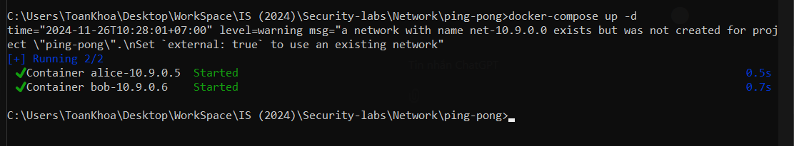
- Alice : Ip 10.9.0.5
- Bob : Ip 10.9.0.6
**1.2 First , We go to create a texyt file**
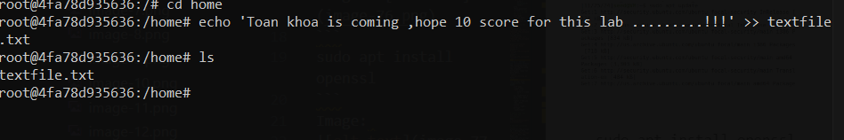

2. **Key-generation**
   1. **Generate RSA key pair (Bob's side)**
    ```openssl genpkey -algorithm RSA -out keypair.pem -pkeyopt rsa_keygen_bits:2048 ```
    - ``openssl genpkey``: The genpkey command in OpenSSL is used to generate a new private key. It is a general-purpose command to generate private keys for different cryptographic algorithms, including RSA.
    - ``genpkey``creates the private key, and you can later extract the corresponding public key from it.
    - ``-algorithm RSA``: This option specifies the cryptographic algorithm to use for key generation. Here, it is set to RSA, which is one of the most common public-key cryptosystems.
    RSA (Rivest-Shamir-Adleman) is an asymmetric encryption algorithm, meaning it uses a pair of keys: a public key to encrypt data and a private key to decrypt it.
    - ``-out keypair.pem``: Saves the private key to keypair.pem.
    - ``2048``: Sets the RSA key length to 2048 bits, which balances security and performance.
    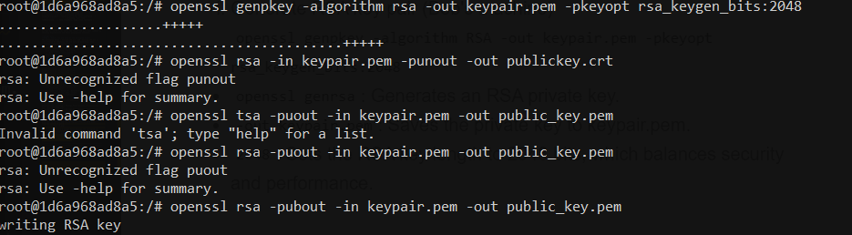
    1. **Extract public key**
    - From the private key, extract the public key:
    - ```openssl rsa -pubout -in keypair.pem -out public_key.pem```
    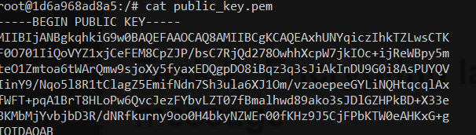
    1. **Transfer public key to Alice**
       1. Grant  permissions
        - Before transferring, ensure the public key file is accessible
        - ```chmod 777 /home```
        1. Send to Send Public Key to Alice
        Transfer Bob’s public key to Alice using scp:
        ```scp publickey.crt alice@10.9.0.5:/home```
        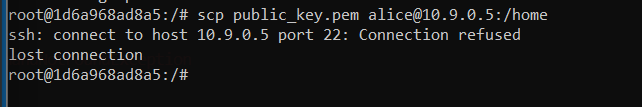
        If the SSH server is not running on Alice’s machine, install and start it:
        ```
        apt update
        apt install openssh-server
        service ssh start
        ```
        
        Try transferring the file again after starting the SSH service.
        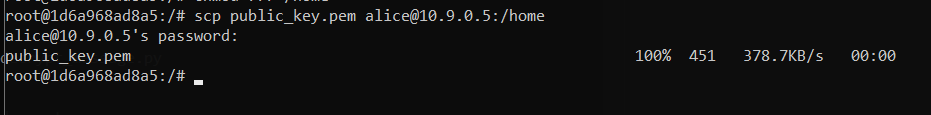
        
    **Result: Alice recieved public key**
    2. **Alice prepares the Encrypted Daataa**
       1. **Generate a random symmetric key**
    Use this command: ``openssl rand -hex 32 > randompassword``
    Generates a random symmetric key for AES encryption:
    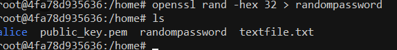
       2. **Encrypt the Text File with AES**
    Encrypt the file (textfile.txt) using AES encryption and the generated symmetric key.
    ``openssl enc -aes-256-cbc -in textfile.txt -out file.enc -pass file:/home/randompassword -pbkdf2 -iter 10000``
       3. **Encrypt the Symmetric Key with RSA**
    Encrypt the symmetric key using Bob's public RSA key.
    ``openssl rsautl -encrypt -inkey public_key.pem -pubin -in randompassword -out randompassword.encrypted``
    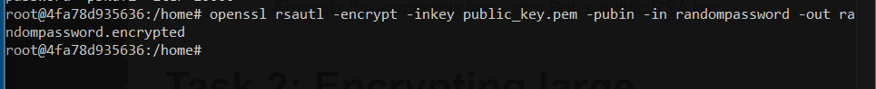
    3. **Transfer Encrypted Files to Bob**
    Alice transmits the encrypted data (file.enc) and the encrypted symmetric key (randompassword.encrypted) to Bob.
    ``scp file.enc randompassword.encrypted bob@10.9.0.6:/home``
    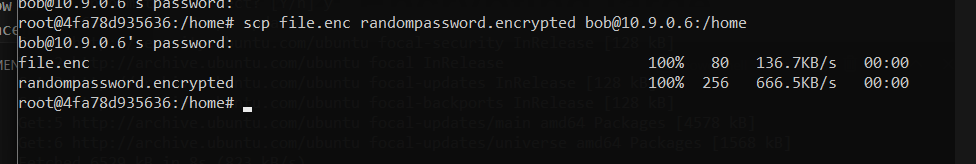
    Bob side: ``ls``
    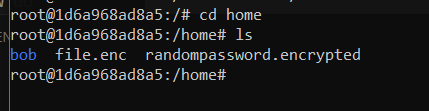
     4. **Bob Decrypts the Data**
        1. **Decrypt the Symmetric Key**
    ``openssl rsautl -decrypt -inkey keypair.pem -in randompassword.encrypted -out randompassword.decrypted``
    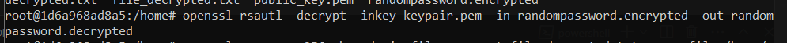
        2. **Decrypt the File with the Symmetric Key**
    ***Bob uses the decrypted symmetric key to decrypt the file:**
    `` openssl enc -aes-256-cbc -d -in file.enc -out file_decrypted.txt -pass file:/home/randompassword.decrypted -pbkdf2 -iter 10000``
    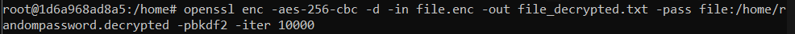
    
 ***Result*** 
 - Complete task : Bob recieved this file 
    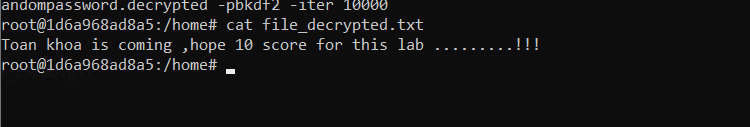
# Task 2: Encrypting large message 
Create a text file at least 56 bytes.
**Question 1**:
Encrypt the file with aes-256 cipher in CFB and OFB modes. How do you evaluate both cipher as far as error propagation and adjacent plaintext blocks are concerned. 
**Answer 1**:
***Step1: Enrypt file with cfb mode:***
- Before this purpose , we go to create iv file
```openssl rand -hex 16 > iv```
Then 
```openssl enc -aes-256-cfb -in textfile.txt -out ciphertext_cfb.bin -K $(cat randompassword) -iv $(cat iv)```

***Step2: Encrypt file with ofb mode:***
```openssl enc -aes-256-ofb -in textfile.txt -out ciphertext_ofb.bin -K $(cat randompassword) -iv $(cat iv)```
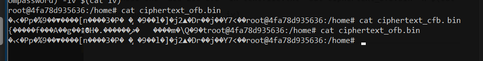

***Explain mode***

**CFB Mode** 
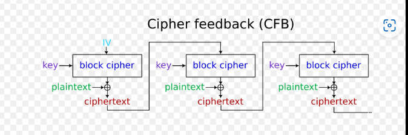
- Error Propagation: High (cascades to next blocks)
  - Cause: CFB uses a feedback mechanism where each ciphertext block influences the next. A single-bit error in the ciphertext will disrupt the decryption of both the current and subsequent plaintext blocks.
  - Impact: This makes CFB vulnerable to errors in environments where data integrity cannot be guaranteed, as even small transmission errors can corrupt multiple blocks.
  - Example: If one bit in the ciphertext block is corrupted, plaintext blocks derived from this and subsequent ciphertext will be incorrect.
- Block Dependency: Strong (feedback required)
  - Cause: CFB encryption depends on the previous ciphertext block for its operation.
  - Impact: This strong dependency ensures robust encryption but also causes errors to cascade.
  - Example: If the ciphertext of block 2 is altered, the decryption of blocks 2 and 3 will fail.
  
**OFB Mode**
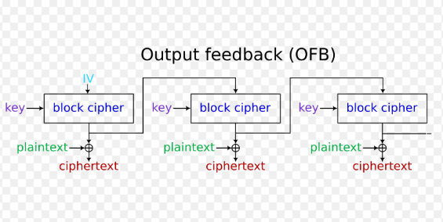
- Error Propagation:Low (isolated to one byte)
  - Cause: OFB generates a keystream independent of the ciphertext, so errors in ciphertext do not propagate.
  - Impact: An error in the ciphertext affects only the corresponding plaintext byte, making OFB suitable for environments prone to transmission errors.
  - Example: Corrupting a byte in the ciphertext results in corruption of only the corresponding plaintext byte.
- Block Dependency: Weak (blocks independent)
  - Cause: The keystream is generated independently of plaintext and ciphertext.
  - Impact: Each block operates independently, so errors in one block do not affect others.
  - Example: Corrupting ciphertext block 2 only affects plaintext block 2, leaving other blocks intact.
___
**Question 2**:
Modify the 8th byte of encrypted file in both modes (this emulates corrupted ciphertext).
Decrypt corrupted file, watch the result and give your comment on Chaining dependencies and Error propagation criteria.

**Answer 2**:
**Step 1. Connect to Alice container**
``docker exec -it alice-10.9.0.5 bash``
- Alice: IP alice-10.9.0.5

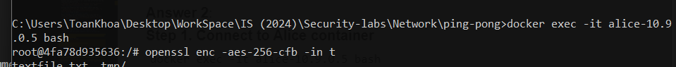

***Step 2. Encrypting the File in AES-256 CFB Mode***
- Use Initialization Vector(IV) as i created before
- ```openssl enc -aes-256-cfb -in textfile.txt -out ciphertext_cfb.bin -K $(cat randompassword) -iv $(cat iv)```
  - **Purpose:** This command encrypts a file (textfile.txt) using the AES-256 algorithm in CFB (Cipher Feedback) mode. It produces an encrypted output (ciphertext_cfb.bin).

***Step 3. Encrypting the File in AES-256 OFB Mode***
- ```openssl enc -aes-256-ofb -in textfile.txt -out ciphertext_ofb.bin -K $(cat randompassword) -iv $(cat iv)```
  - **Purpose:** This command encrypts a file (textfile.txt) using the AES-256 algorithm in OFB (Output Feedback) mode, generating an encrypted output file (ciphertext_ofb.bin). The OFB mode is a block cipher mode where the output of the encryption process is used as a keystream to encrypt the plaintext. 
  
***Step 4.Modifying the 8th Byte in the Ciphertext***
- ``dd if=/dev/zero bs=1 count=1 seek=7 conv=notrunc of=ciphertext_cfb.bin`` for CFB Encrypted file
- ``dd if=/dev/zero bs=1 count=1 seek=7 conv=notrunc of=ciphertext_ofb.bin`` for OFB Encrypted file 
- 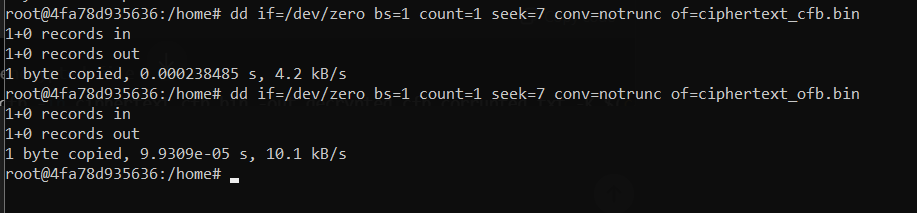
  - **Purpose:** The purpose of the dd command in Step 4 is to simulate the corruption of the ciphertext by modifying a specific byte (in this case, the 8th byte) of the encrypted file. This emulates a real-world scenario where ciphertext might become corrupted during transmission or storage. By modifying a single byte, you can observe how this corruption propagates during decryption and how it affects the resulting plaintext in different encryption modes (CFB vs. OFB).
  

**After modifying we go to view it**
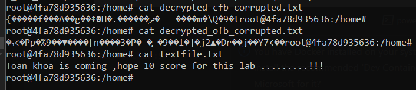

So Observation: 
- CFB (Cipher Feedback) Mode: The decrypted output (decrypted_cfb_corrupted.txt) appears to be garbled with unreadable characters, but there’s a consistent pattern that suggests multiple blocks of data have been affected. The CFB mode causes error propagation. This means that the corruption of one byte in the ciphertext will not only affect the corresponding plaintext byte but will also propagate to other adjacent blocks. As a result, more data is corrupted in CFB mode compared to OFB mode.
- OFB (Output Feedback) Mode: The decrypted output (decrypted_ofb_corrupted.txt) also shows corruption, but it seems more localized. The byte that was modified affects only the corresponding byte in the decrypted plaintext, with fewer subsequent changes compared to CFB. This is characteristic of OFB mode, where error propagation is minimal, and only the corrupted byte will be affected.

**Conclusion**
- CFB Mode: The error affects more than one block, showing how the modification of a single byte in the ciphertext propagates throughout the entire block of plaintext. This makes CFB less tolerant of corruption compared to OFB.
- OFB Mode: The error is confined to the specific byte that was corrupted, demonstrating OFB's robustness in handling transmission errors.


