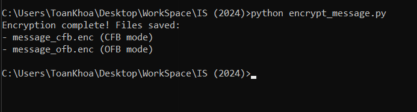
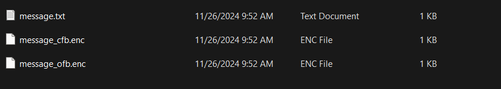
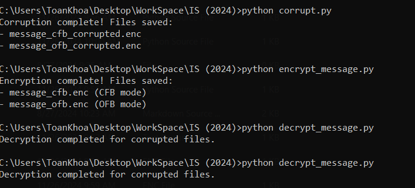

# Task 1: Public-key based authentication 
**Question 1**: 
Implement public-key based authentication step-by-step with openssl according the following scheme.


**Answer 1**:

1. **Setup**
**1.1 we have a network with two computers:**

- Alice : Ip 10.9.0.5
- Bob : Ip 10.9.0.6
**1.2 First , We go to create a texyt file**


2. **Key-generation**
   1. **Generate RSA key pair (Bob's side)**
    ```openssl genpkey -algorithm RSA -out keypair.pem -pkeyopt rsa_keygen_bits:2048 ```
    - ``openssl genpkey``: The genpkey command in OpenSSL is used to generate a new private key. It is a general-purpose command to generate private keys for different cryptographic algorithms, including RSA.
    - ``genpkey``creates the private key, and you can later extract the corresponding public key from it.
    - ``-algorithm RSA``: This option specifies the cryptographic algorithm to use for key generation. Here, it is set to RSA, which is one of the most common public-key cryptosystems.
    RSA (Rivest-Shamir-Adleman) is an asymmetric encryption algorithm, meaning it uses a pair of keys: a public key to encrypt data and a private key to decrypt it.
    - ``-out keypair.pem``: Saves the private key to keypair.pem.
    - ``2048``: Sets the RSA key length to 2048 bits, which balances security and performance.
    
    1. **Extract public key**
    - From the private key, extract the public key:
    - ```openssl rsa -pubout -in keypair.pem -out public_key.pem```
    
    1. **Transfer public key to Alice**
       1. Grant  permissions
        - Before transferring, ensure the public key file is accessible
        - ```chmod 777 /home```
        1. Send to Send Public Key to Alice
        Transfer Bob’s public key to Alice using scp:
        ```scp publickey.crt alice@10.9.0.5:/home```
        
        If the SSH server is not running on Alice’s machine, install and start it:
        ```
        apt update
        apt install openssh-server
        service ssh start
        ```
        
        Try transferring the file again after starting the SSH service.
        
        
    **Result: Alice recieved public key**
    2. **Alice prepares the Encrypted Daataa**
       1. **Generate a random symmetric key**
    Use this command: ``openssl rand -hex 32 > randompassword``
    Generates a random symmetric key for AES encryption:
    
       2. **Encrypt the Text File with AES**
    Encrypt the file (textfile.txt) using AES encryption and the generated symmetric key.
    ``openssl enc -aes-256-cbc -in textfile.txt -out file.enc -pass file:/home/randompassword -pbkdf2 -iter 10000``
       3. **Encrypt the Symmetric Key with RSA**
    Encrypt the symmetric key using Bob's public RSA key.
    ``openssl rsautl -encrypt -inkey public_key.pem -pubin -in randompassword -out randompassword.encrypted``
    
    3. **Transfer Encrypted Files to Bob**
    Alice transmits the encrypted data (file.enc) and the encrypted symmetric key (randompassword.encrypted) to Bob.
    ``scp file.enc randompassword.encrypted bob@10.9.0.6:/home``
    
    Bob side: ``ls``
    
     4. **Bob Decrypts the Data**
        1. **Decrypt the Symmetric Key**
    ``openssl rsautl -decrypt -inkey keypair.pem -in randompassword.encrypted -out randompassword.decrypted``
    
        2. **Decrypt the File with the Symmetric Key**
    ***Bob uses the decrypted symmetric key to decrypt the file:**
    `` openssl enc -aes-256-cbc -d -in file.enc -out file_decrypted.txt -pass file:/home/randompassword.decrypted -pbkdf2 -iter 10000``
    
    
 ***Result*** 
 - Complete task : Bob recieved this file 
    
# Task 2: Encrypting large message 
Create a text file at least 56 bytes.
**Question 1**:
Encrypt the file with aes-256 cipher in CFB and OFB modes. How do you evaluate both cipher as far as error propagation and adjacent plaintext blocks are concerned. 
**Answer 1**:
***Step 1: Create a Text File***
Firstly, I have created a `message.txt` with a size of at least 56 bytes:

```bash
Hello, my name is Nguyen Nguyen Toan Khoa, my id is 22110044, and I happy to help you. Hope you having a wonderful day! Today, I have a really important test but my health is not OK. Say bye!
```
***Step 2: Write and Execute the Encryption Script***
The next step involves using Python with the pycryptodome library to implement the encryption. The key elements will include:
``` pip install pycryptodome ```
- **Key:** A 256-bit (32-byte) key to meet AES-256 requirements.
- **IV:** A random 16-byte value to ensure unique encryption for every operation.
- **Modes:**
  - CFB (Cipher Feedback)
  - OFB (Output Feedback)

And here is the encryption process included:
1. Loading the plaintext file.
2. Encrypting the file using AES-256 in both modes.
3. Writing the ciphertext to separate files: `message_cfb.enc` and `message_ofb.enc`.
##### **Code Overview**
At here, i have created `encrypt_message.py` file to do the encryption in 2 modes.

```python
from Crypto.Cipher import AES
from Crypto.Util.Padding import pad
import os

# Load the plaintext file
with open("message.txt", "rb") as f:
    plaintext = f.read()

# Define a 256-bit key (32 bytes) and a random IV (16 bytes)
key = b"mysecretkeyissupersecuren32bytes"  
iv = os.urandom(16)

# Encrypt using AES-256 in CFB mode
cipher_cfb = AES.new(key, AES.MODE_CFB, iv=iv)
ciphertext_cfb = cipher_cfb.encrypt(plaintext)
with open("message_cfb.enc", "wb") as f:
    f.write(iv + ciphertext_cfb)

# Encrypt using AES-256 in OFB mode
cipher_ofb = AES.new(key, AES.MODE_OFB, iv=iv)
ciphertext_ofb = cipher_ofb.encrypt(plaintext)
with open("message_ofb.enc", "wb") as f:
    f.write(iv + ciphertext_ofb)

print("Encryption complete! Files saved:")
print("- message_cfb.enc (CFB mode)")
print("- message_ofb.enc (OFB mode)")
```
This script will generate two encrypted files: 
- `message_cfb.enc` (encrypted using CFB mode).
- `message_ofb.enc` (encrypted using OFB mode).
***Result:***
After executing the script, both files were generated successfully. The encryption process was verified by comparing the sizes of the output files, which included both the IV and the ciphertext.

"This is the message.txt file along with the two encrypted files. Now, you can check the sizes of the output files."

#### **Evaluation of Modes**
| Feature                | **CFB Mode**                          | **OFB Mode**                         |
| ---------------------- | ------------------------------------- | ------------------------------------ |
| **Error Propagation**  | Affects current and next block        | Affects only corresponding bit       |
| **Plaintext Handling** | Conceals patterns; feedback-dependent | Conceals patterns; keystream-based   |
| **Use Case**           | Streaming, real-time communication    | File transfers, high error tolerance |

___
**Question 2**:
Modify the 8th byte of encrypted file in both modes (this emulates corrupted ciphertext).
Decrypt corrupted file, watch the result and give your comment on Chaining dependencies and Error propagation criteria.

**Answer 2**:
**Step 1. Modify the 8th byte of the encrypted file**
The encrypted files (message_cfb.enc and message_ofb.enc) were modified by changing the 8th byte of each file, simulating corruption in the ciphertext.
I will create a `corrupt.py` file for this purpose:
```python
def corrupt_file(input_file, output_file, byte_position):
    with open(input_file, "rb") as f:
        data = bytearray(f.read())
    data[byte_position] ^= 0xFF  # Flip all bits of the 8th byte
    with open(output_file, "wb") as f:
        f.write(data)

# Corrupt the 8th byte
corrupt_file("message_cfb.enc", "message_cfb_corrupted.enc", 8)
corrupt_file("message_ofb.enc", "message_ofb_corrupted.enc", 8)

print("Corruption complete! Files saved:")
print("- message_cfb_corrupted.enc")
print("- message_ofb_corrupted.enc")
```
**Step 2. Decrypt the corrupted files**
The corrupted files were decrypted using the original decryption logic for both modes.
Create `decrypt_message.py` file:
```python
def decrypt_file(input_file, key, mode):
    with open(input_file, "rb") as f:
        data = f.read()
    iv, ciphertext = data[:16], data[16:]
    cipher = AES.new(key, mode, iv=iv)
    return cipher.decrypt(ciphertext)

# Define the same key used for encryption
key = b"mysecretkeyissupersecuren32bytes"  

# Decrypt corrupted files
plaintext_cfb_corrupted = decrypt_file("message_cfb_corrupted.enc", key, AES.MODE_CFB)
plaintext_ofb_corrupted = decrypt_file("message_ofb_corrupted.enc", key, AES.MODE_OFB)

print("Decryption completed for corrupted files.")
```
**Step 3. Observe and analyze the results**
The outputs of the corrupted files were compared to the original plaintext to analyze how the corruption affected each mode.
Then the result we get: 

#### **Result**
When I compared the two output files (message_cfb_corrupted.enc and message_ofb_corrupted.enc), I concluded that:

| **Mode** | **Behavior**                                                                                                                                                        |
| -------- | ------------------------------------------------------------------------------------------------------------------------------------------------------------------- |
| **CFB**  | The corruption in the 8th byte caused errors in the decrypted plaintext for both the affected block and the following block. However, the rest of the blocks remained unaffected. |
| **OFB**  | The corruption in the 8th byte impacted only the corresponding byte in the plaintext. No additional errors were introduced, as OFB does not rely on chaining.           |


