# Chapter 03: Access control
## Part 1: Authentication
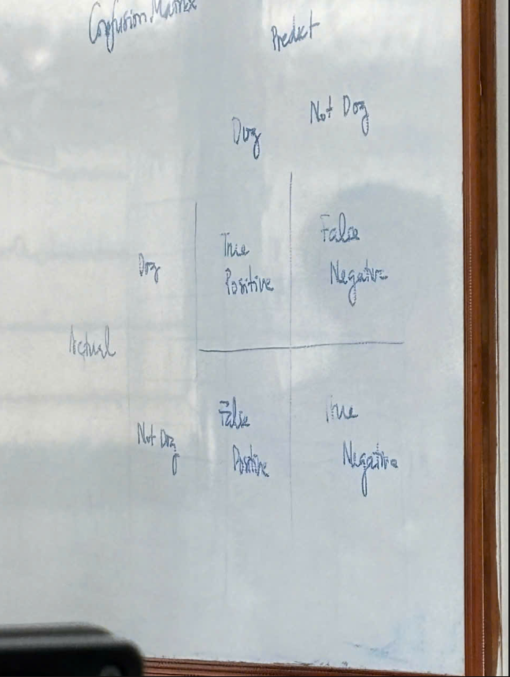
- Somthing you know là cái gi đo bảo maậ như mat khau
- Something you have la cccd =))
- Something you are ->
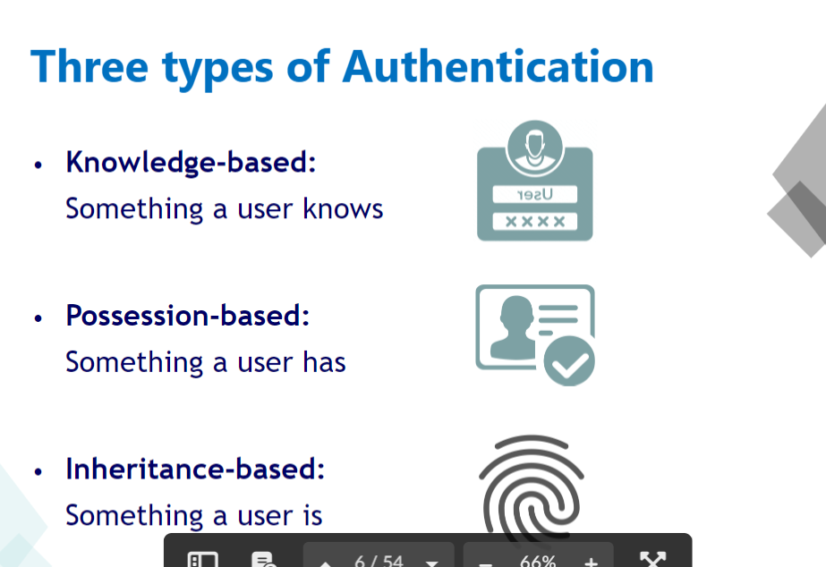

**Trust path** la duong di cua thong tin phai dam bao an toan
## Password authentication
- Rui~ ro den tu nguoi dung`
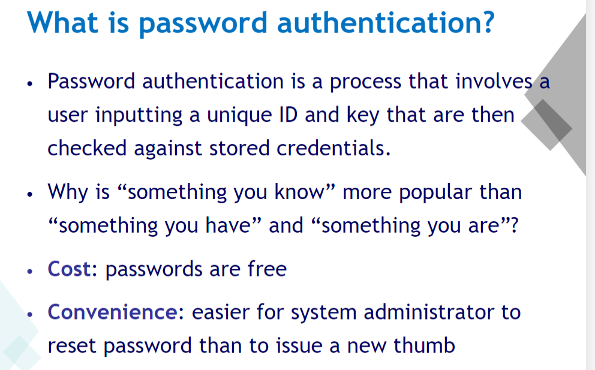
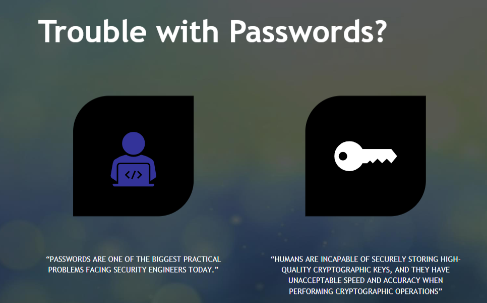
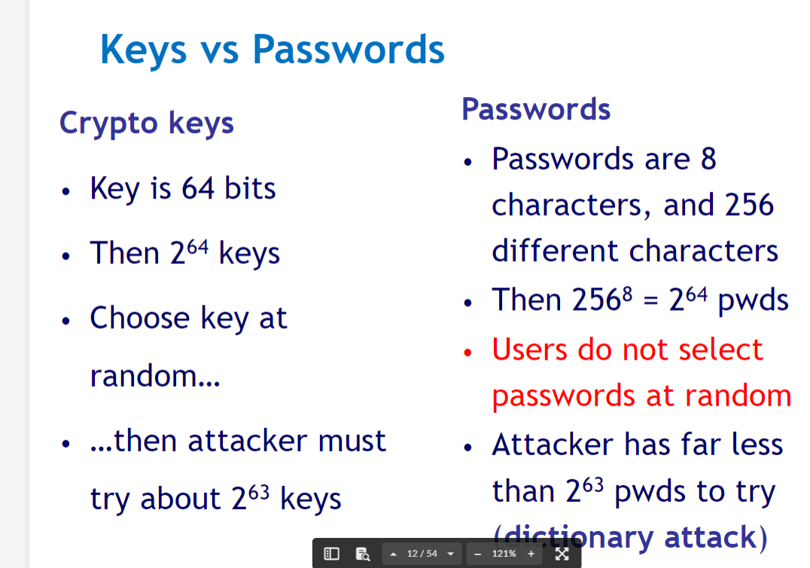
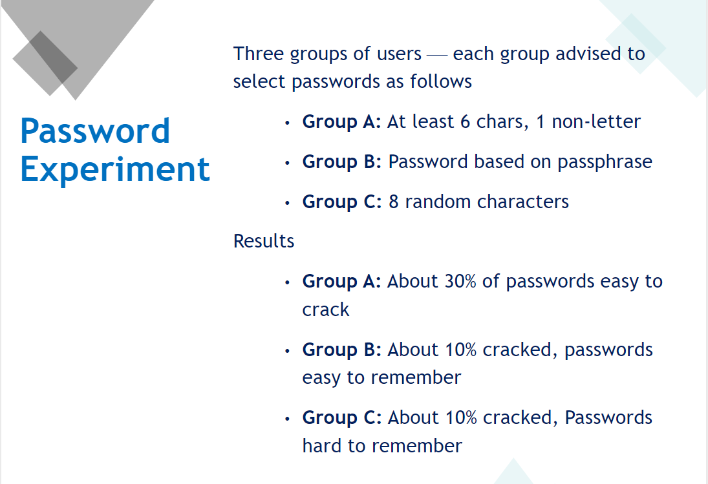
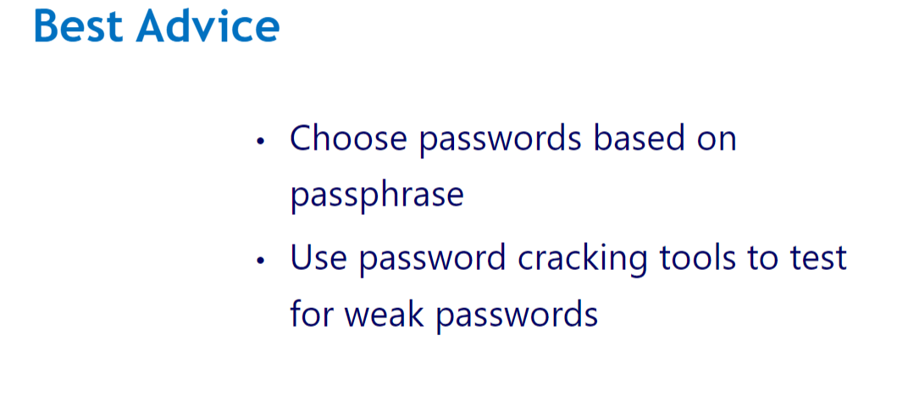
- Passphrase la mot cau thanh ngu~ de~ nho vd: mat khau wifi : onthecloudnight
### Implementing Password Authentication
- Using hash 
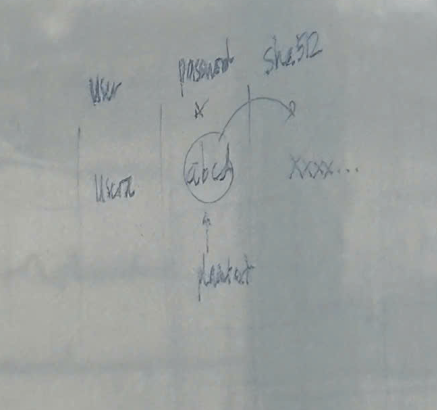
- Using string to ma~ hoa 
**In Linux**
**Tóm tắt cách Linux bảo vệ mật khẩu:**
- Lưu mật khẩu băm trong tệp /etc/shadow: Tệp này chỉ có thể truy cập bởi người dùng có quyền root.
- Băm mật khẩu bằng các thuật toán mạnh như SHA-512, bcrypt để lưu trữ mật khẩu dưới dạng băm.
- Sử dụng salt để làm cho mỗi mật khẩu băm trở nên duy nhất, ngay cả khi mật khẩu gốc giống nhau.
- Sử dụng key stretching để làm chậm quá trình tính toán băm, giảm thiểu khả năng bị tấn công brute-force.
- PAM được sử dụng để tăng cường quy trình xác thực và bảo vệ mật khẩu khỏi tấn công brute-force và brute-force qua cơ chế giới hạn lần đăng nhập sai.
- The way to connect and see result :
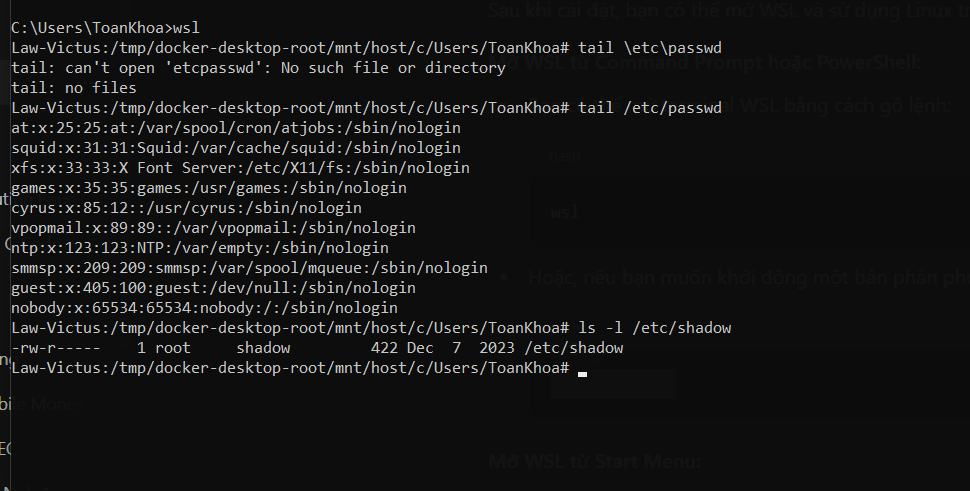    
- Hacker attack in many ways:
  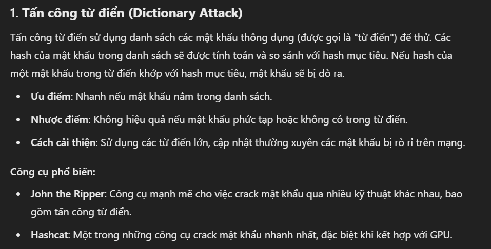
  
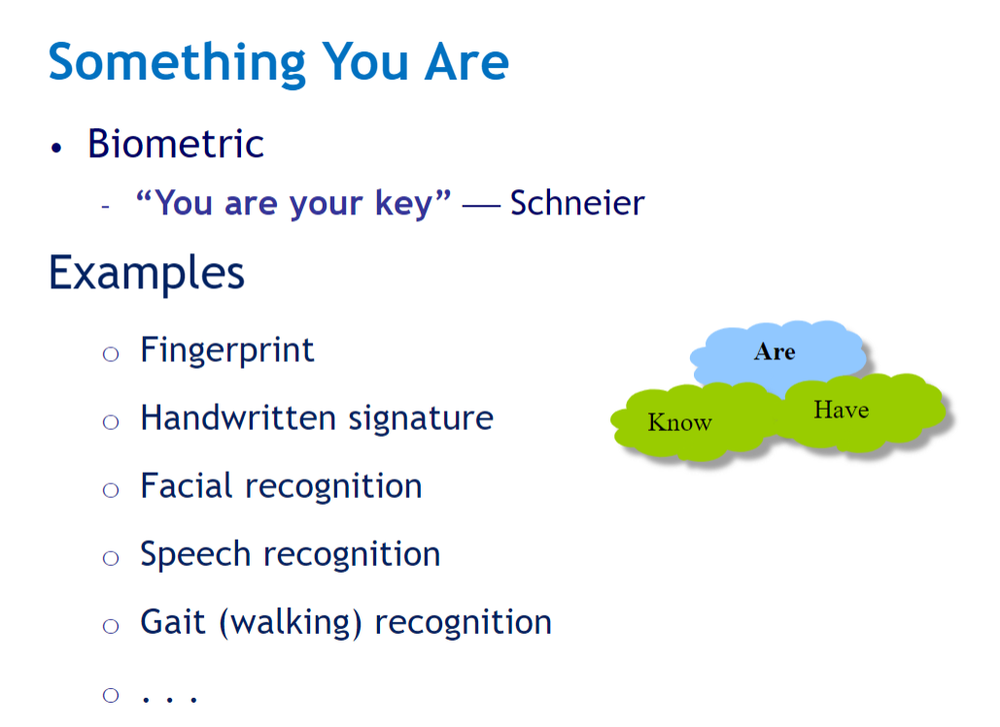
**Biometrics slide 36** : bieu~ do ve nhip tim
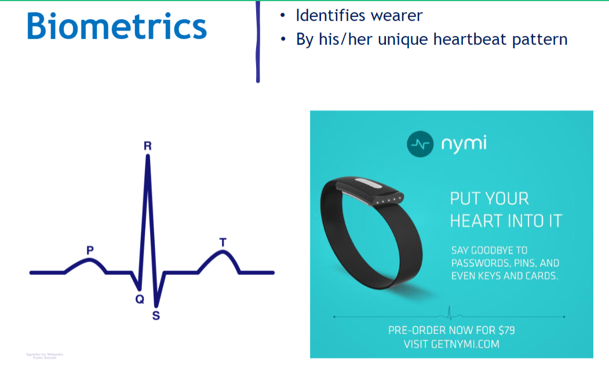
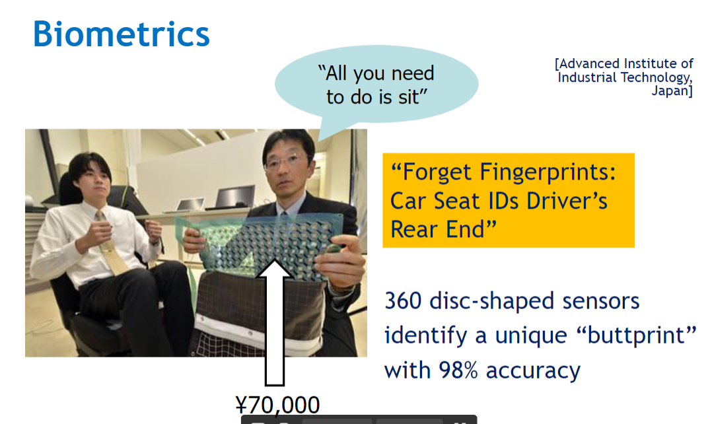
# Access control 
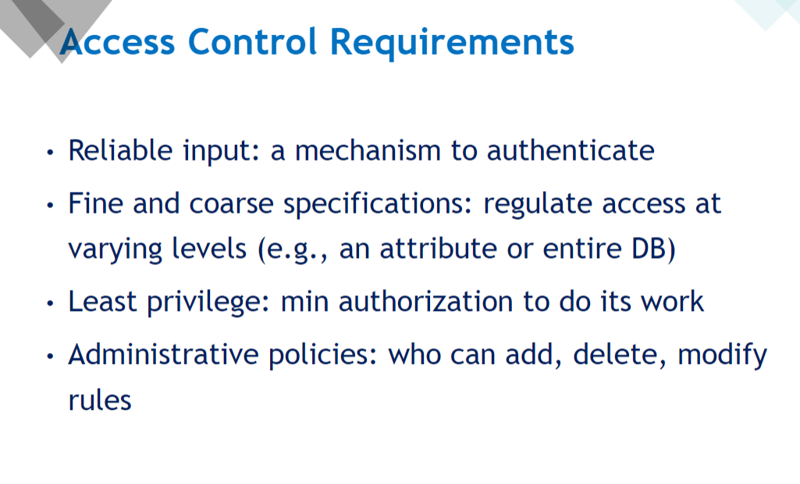
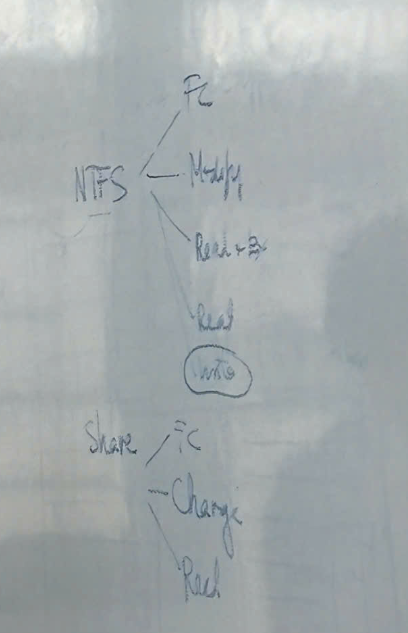
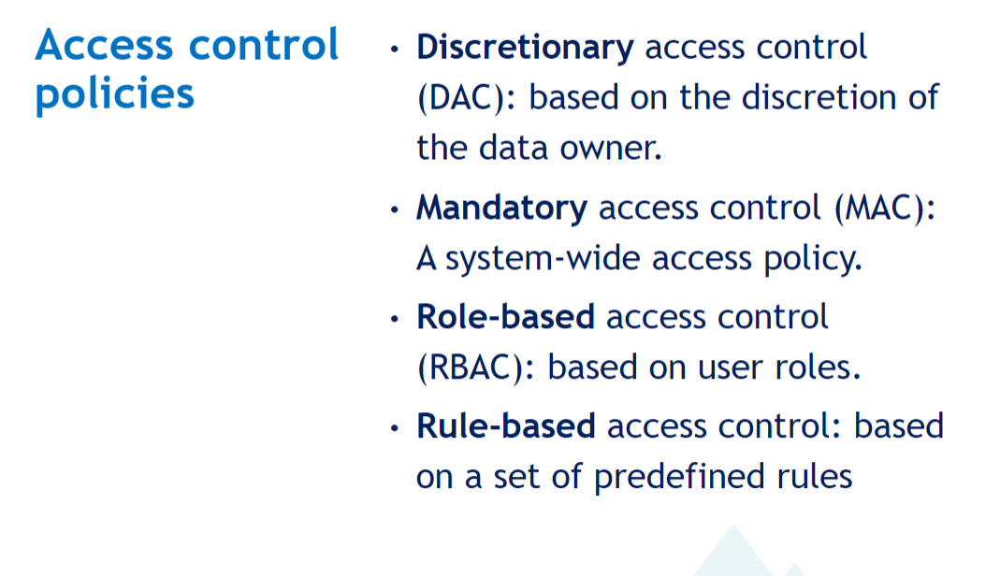
- DicretionaDisc: kiem~ soat truy cap tuy quyen : muon gan quyen cho nguoi dung su dung
- Mandatory: Kiem soat truy cap bat buoc ( ap dat o muc he thong , vao la dung ko co lam gi duoc nua )
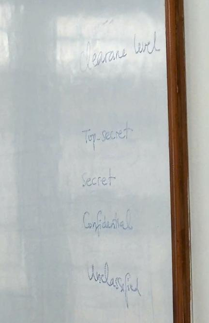
- Role-based: (RBAC) trong database , trong doanh nghieepk , trong networking ( group usser ...)
- Rule-based: Kiem soat truy cap theo luat 
Linkedlist
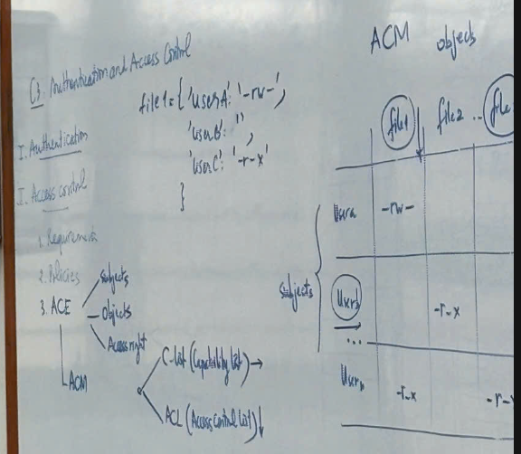
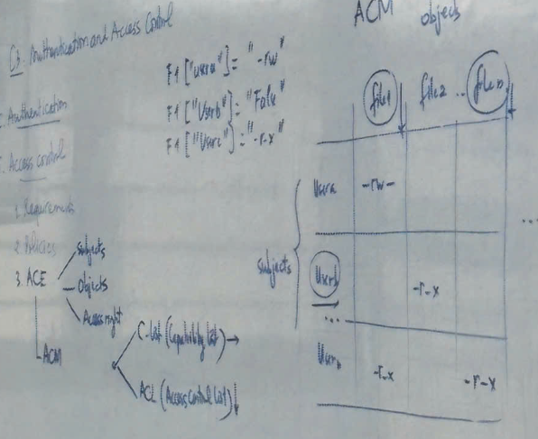
** UNIX File Access Control
