# Chapter 04 : Web security
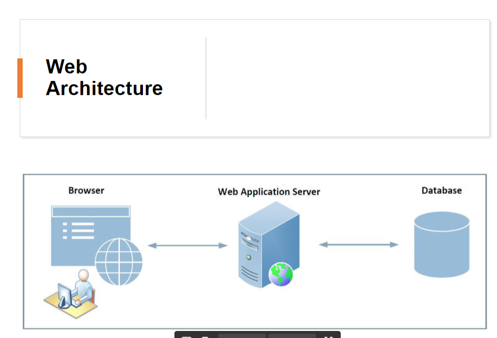
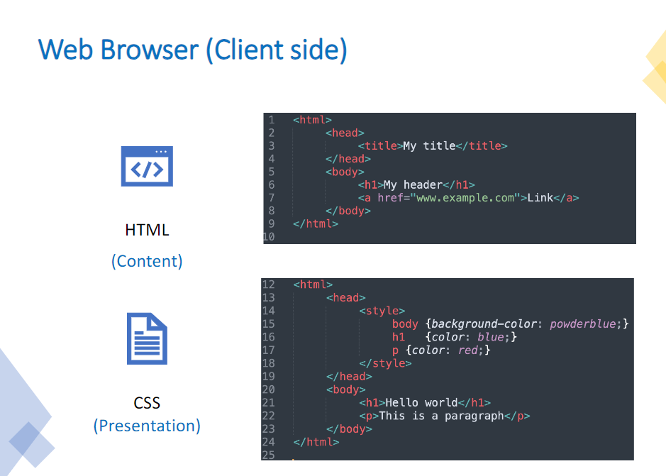
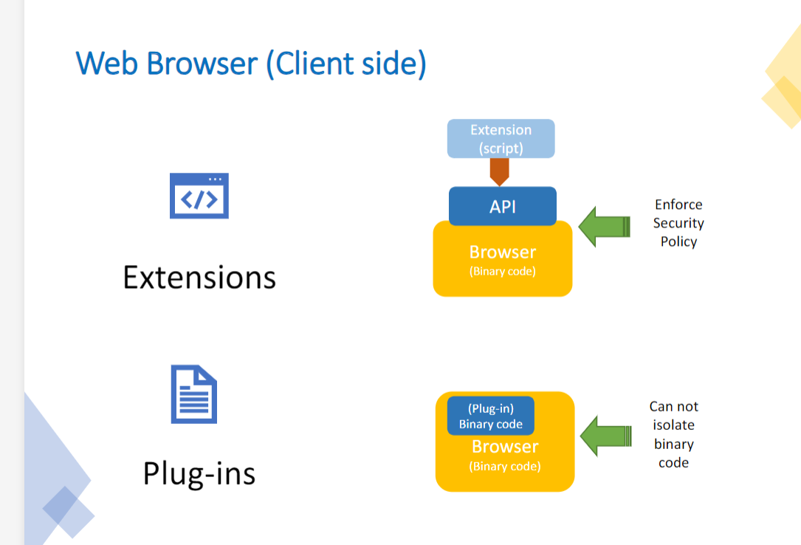
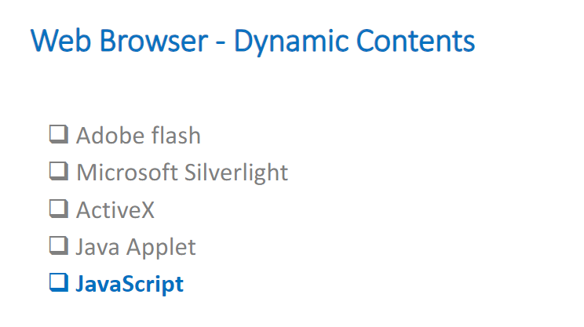
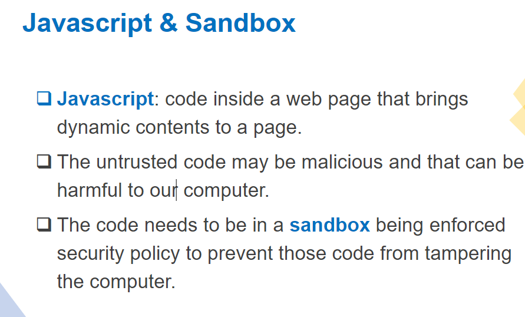
- API cua trinh duyet thuc chat la cai sandbox
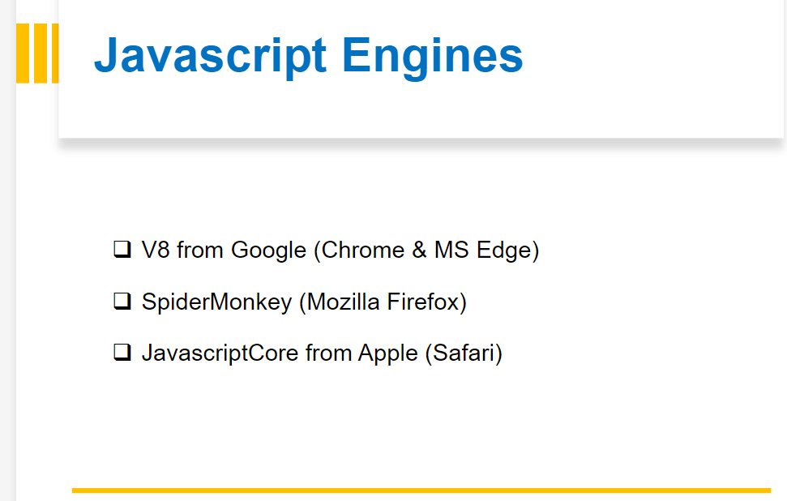
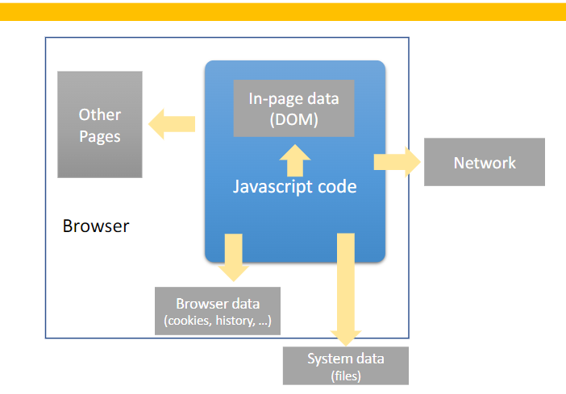
- Truy xuat file phai co su chap nhan cua nguoi dung 
- For example : 
  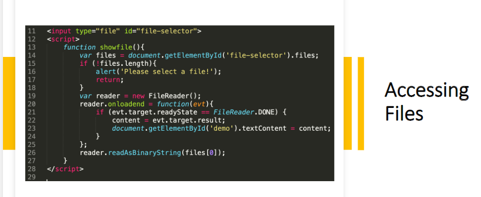
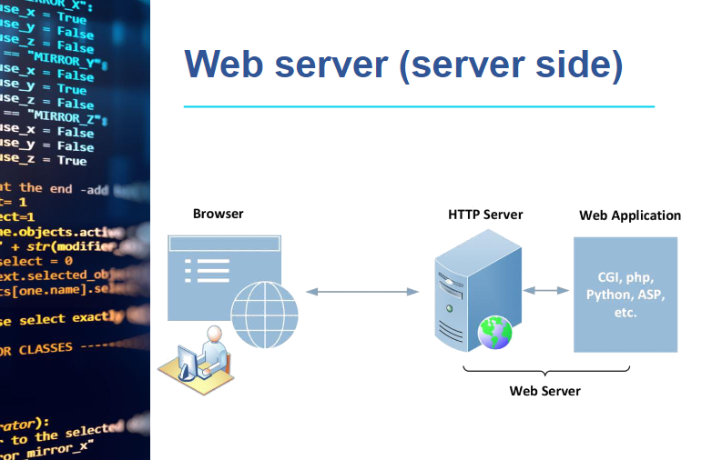
- Browser: frontend 
- Web server
- GET vs post:
  - 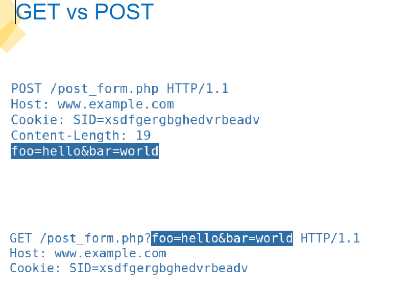
  - Get se lay data luu ngay cai duong dan , nhu the se ko bao~ mat 
  - Post se giau no di , khong de tren duong link
  
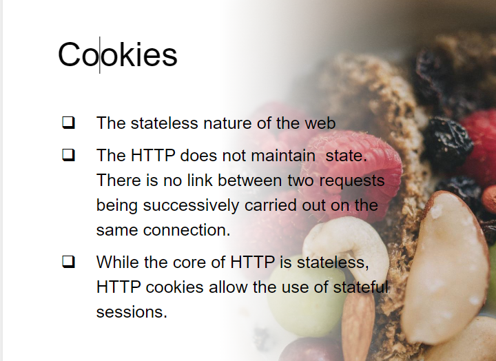
- Stateless : goi lai tu dau 
- stateful luu lai de trong sever de may lan truy xuat tiep theo no se biet duoc ai truy xuat 
## SOP -> Same-Origin policy 
- The same-origin policy restricts scripts on one
origin from accessing data from another origin.
- An origin consists of a URI scheme, domain and
port number.
- http://www.website.com/example/index.html
- cong mac dinh cua dich vu ưweb la 80 

**Same-origin được xác định bởi 3 yếu tố: scheme (giao thức), domain (tên miền), và port (cổng). Một URL có thể được xem là cùng nguồn (same-origin) với một URL khác khi cả ba yếu tố này đều giống nhau.**

- Ví dụ:
    - http://normal-website.com/example và http://normal-website.com/example2 được coi là cùng nguồn vì chúng có cùng scheme (HTTP), domain, và port (mặc định là 80 cho HTTP).
Ngược lại, nếu có sự khác biệt về bất kỳ yếu tố nào:

  - https://normal-website.com/example không cùng nguồn vì khác scheme (HTTPS thay vì HTTP).
  -   http://en.normal-website.com/example không cùng nguồn vì khác domain (subdomain "en" đã thay đổi).
  - http://normal-website.com:8080/example không cùng nguồn vì khác port (8080 thay vì mặc định 80 cho HTTP).